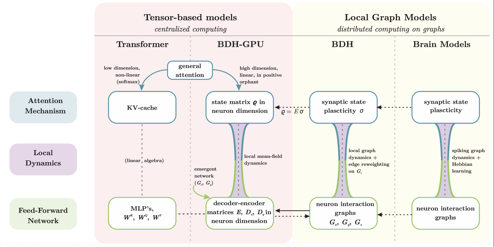

## Baby Dragon Hatchling
This repository contains source code from the paper: Adrian Kosowski, Przemysław Uznański, Jan Chorowski, Zuzanna Stamirowska, Michał Bartoszkiewicz, _"The Dragon Hatchling: The Missing Link between the Transformer and Models of the Brain"_, [link](https://doi.org/10.48550/arXiv.2509.26507).

## Architecture
 

## Relation to Tranformers
 

## Scaling laws
 

## Abstract:
The relationship between computing systems and the brain has served as motivation for pioneering theoreticians since John von Neumann and Alan Turing. 
Uniform, scale-free biological networks, such as the brain, have powerful properties, including generalizing over time, which is the main barrier for Machine Learning on the path to Universal Reasoning Models.

We introduce `Dragon Hatchling' (BDH), a new Large Language Model architecture based on a scale-free biologically inspired network of $n$ locally-interacting neuron particles. BDH couples strong theoretical foundations and inherent interpretability without sacrificing Transformer-like performance.

BDH is a practical, performant state-of-the-art 
attention-based state space sequence learning architecture. 
In addition to being a graph model, BDH admits a GPU-friendly formulation.
It exhibits Transformer-like scaling laws: we find empirically that BDH rivals GPT2-architecture Transformer performance on language and translation tasks, at the same number of parameters (10M to 1B), for the same training data.

BDH provides theoretical foundations for understanding model behavior in the limit of large size and reasoning time. 
Our results, formalized as a chain of reductions of expressiveness in the framework of computational Complexity Theory and Distributed Computing, and combined with findings on the BDH model, show a macro-to-micro correspondence of function between the general attention mechanisms in state-of-the-art Language Models, and attention mechanisms observed in the brain. These attention mechanisms formally converge as closed-form local graph dynamics at neurons and synapses: _the equations of reasoning_.

BDH can be represented as a brain model. It contains $n$ neurons, organized as an excitatory circuit and an inhibitory circuit with integrate-and-fire thresholding of input signals at neurons. The working memory of BDH during inference entirely relies on synaptic plasticity with Hebbian learning using spiking neurons, at potentiation scales of minutes for the brain (up to hundreds of tokens). We confirm empirically that specific, individual synapses strengthen connection whenever BDH hears or reasons about a specific concept while processing language inputs. The neuron interaction network of BDH is a graph of high modularity with heavy-tailed degree distribution. The BDH model is biologically plausible, explaining one possible mechanism which human neurons could use to achieve speech.

BDH is designed for interpretability. Activation vectors of BDH are sparse and positive. We demonstrate monosemanticity in BDH on language tasks, including representation of concept abstractions, which happens even for small models, below 100M-parameter scale. Interpretability of state, which goes beyond interpretability of neurons and model parameters, is an inherent feature of the BDH architecture. 

We believe BDH opens the door to a new theory of _Thermodynamic Limit_ behavior for language and reasoning models, with the ultimate goal of Probably Approximately Correct (PAC)-like bounds for generalization of reasoning over time.

## Running the code

To train and sample from the BDH model on a toy language modeling task please do:
1. `pip install -r requirements.txt`
2. `python train.py`

## Acknowledgements
We thank Andrej Karpathy for the [nanoGPT](https://github.com/karpathy/nanoGPT/) code and the tiny Shapespeare dataset used in this demonstration.
